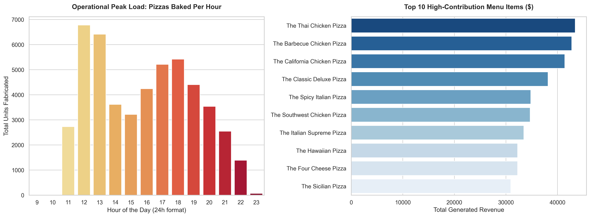

# Multi-Unit Fast-Food Operations & Resource Optimization Analytics Pipeline

### Interactive Analytics Dashboard Output

An end-to-end analytics workflow built using a programmatic pipeline to assess commercial throughput, operational peak load boundaries, and high-contribution menu performance indicators. 

## Technical Architecture & Tool Stack
* **Database Infrastructure:** Microsoft SQL Server 2025
* **Programming Environment:** Python 3.x
* **Core Data Engineering Stack:** Pandas, SQLAlchemy, PyODBC
* **Statistical Visualization Stack:** Matplotlib, Seaborn

## Key Analytical Frameworks Implemented

### 1. Infrastructure Peak-Load Capacity Evaluation
Utilized advanced **SQL Common Table Expressions (CTEs)** and mathematical window ranking functions (`RANK() OVER`) to aggregate order generation density by running operating hours. This maps infrastructure stress to pinpoint exact workforce capacity constraints during daily cycles.

### 2. Commercial Contribution Portfolio Review
Calculated gross financial product performance across menu variations to evaluate structural health. This isolates high-volume anchors from low-performing menu options, giving management a quantitative framework for supply-chain scaling and potential menu pruning.

## Strategic Business Insights

* **The Double-Peak Constraints:** The franchise experiences severe throughput demands concentrated in distinct bi-modal operational phases—Lunch Volume spike (12:00–13:00) and Dinner Surge load (17:00–19:00). These metrics indicate exactly where scheduling shifts must be scaled up to maintain speed-of-service.
* **Premium Asset Isolation:** Top-tier chicken-based configurations account for the highest concentration of total top-line revenue growth, justifying protected inventory allocation pipelines over lower-margin variations.
